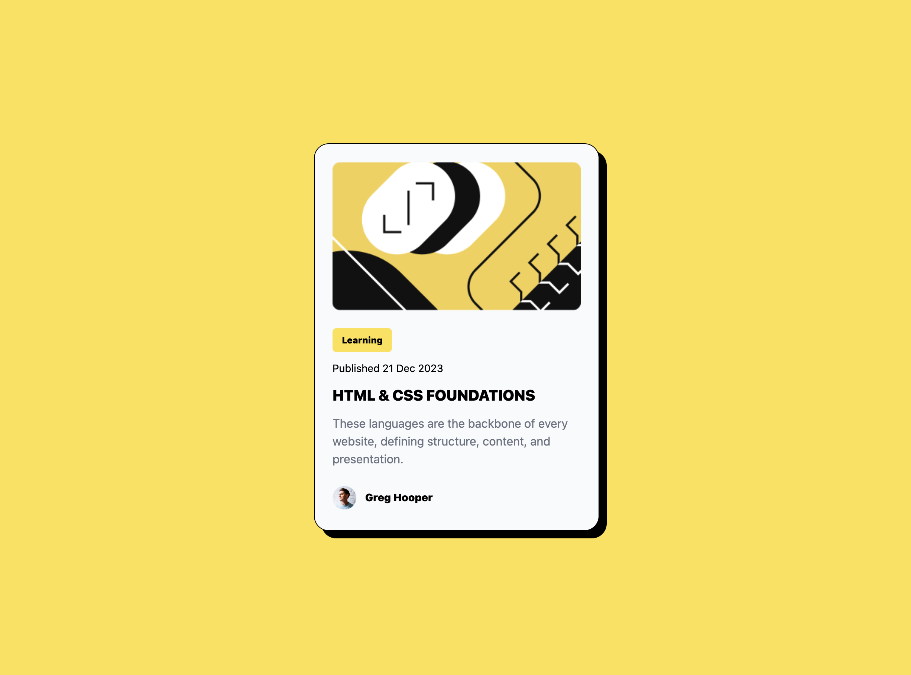

## Table of contents
- [Screenshot](#screenshot)
- [My process](#my-process)
- [Built with](#built-with)
- [What I learned](#what-i-learned)
- [Useful resources](#useful-resources)
- [Author](#author)

### Screenshot



## My process

### Built with
- Semantic HTML5 markup
- [Tailwind CSS](https://tailwindcss.com/) - Utility first CSS framewwork
- [React](https://reactjs.org/) - JS library

### What I learned

It was really intimidating to work on this project with React and Tailwind. Keeping in mind that I have never used the framework in a project before. Setting the two frameworks was hard, and using tailwind css as opposed to vanilla css was hard. As I was used to naming my classes the applying the styles I needed in a separate CSS.

A challenge I face was in writing cusom css usign tailwind. I found a quick hack shown below which helped me in writing custom css together with Tailwindcss 

```html
<p className="rounded-[5px]">
My Paragraph
</p>
```

### Useful resources

- [Tailwind CSS DOCS](https://tailwindcss.com/docs) - This helped me understand Tailwind syntax.

## Author

- Website - [Johnstone Wahome](#)
